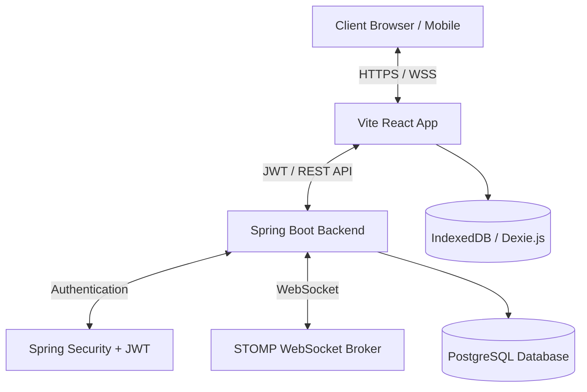

# TripSync — Collaborative Trip Expense Management Platform

<p align="center">
  
</p>

<p align="center">
  <strong>A cloud-deployed full-stack expense management platform for collaborative group travel.</strong>
</p>

<p align="center">
  
  
  
  
</p>

---

## 🌐 Live Demo

### Frontend

[https://trip-sync-pied.vercel.app](https://trip-sync-pied.vercel.app)

### Backend API

[https://tripsync-wepb.onrender.com](https://tripsync-wepb.onrender.com)

---

## 📌 Overview

TripSync is a collaborative trip expense management platform built for groups traveling together. It allows users to:

* Create and manage shared trips
* Add and split expenses among members
* Track balances in real-time
* Resolve disputes
* Generate optimized settlement plans
* Continue operating even during unstable internet connectivity

The project focuses on real-world engineering challenges including:

* JWT authentication
* Cloud deployment
* Real-time synchronization
* Offline-first architecture
* WebSocket communication
* Database persistence
* Cross-platform responsiveness

---

# 📸 Application Preview

## 🔐 Login Page

<p align="center">
  
</p>

---

## 📝 Register Page

<p align="center">
  
</p>

---

## ✈️ Trip Management

<p align="center">
  
</p>

---

# 🚀 Features

## 🔑 Authentication & Security

* Secure JWT-based authentication
* Spring Security integration
* Persistent login sessions
* Password encryption using BCrypt

## 💵 Expense Management

* Create shared group trips
* Add and split expenses equally
* Track who paid and who owes
* Automatic balance calculations

## ⚡ Real-Time Updates

* WebSocket-based synchronization using STOMP + SockJS
* Live updates when members add or modify expenses
* Instant dashboard refresh across connected clients

## 📶 Offline-First Support

* IndexedDB local caching using Dexie.js
* Queue-based offline expense synchronization
* Automatic sync recovery after reconnecting to network

## 📊 Analytics Dashboard

* Spending breakdown by categories
* Member contribution comparison
* Expense visualization using Recharts

## ⚖️ Settlement Engine

* Greedy debt simplification algorithm
* Minimizes number of transactions between travelers
* Automatically generates optimized settlements

## 🚩 Dispute Management

* Flag suspicious or incorrect expenses
* Track dispute reasons
* Resolve disputes within the trip workflow

---

# 🏗️ System Architecture



---

# 🛠️ Tech Stack

## Frontend

* React.js
* Vite
* Tailwind CSS
* Axios
* React Router DOM
* Recharts
* Dexie.js
* SockJS + STOMP Client

## Backend

* Java 20
* Spring Boot 3
* Spring Security
* JWT Authentication
* Spring Data JPA
* Hibernate
* WebSocket STOMP
* Swagger / OpenAPI

## Database

* PostgreSQL (Neon)
* H2 (Local Development)

## Deployment

* Frontend: Vercel
* Backend: Render
* Database: Neon PostgreSQL
* Dockerized Spring Boot deployment

---

# 🔌 API Endpoints

## Authentication

| Method | Endpoint         | Description       |
| ------ | ---------------- | ----------------- |
| POST   | `/auth/register` | Register new user |
| POST   | `/auth/login`    | Login user        |

## Trips

| Method | Endpoint                  | Description      |
| ------ | ------------------------- | ---------------- |
| POST   | `/trips`                  | Create trip      |
| GET    | `/trips`                  | Get user trips   |
| GET    | `/trips/{tripId}`         | Get trip details |
| POST   | `/trips/{tripId}/members` | Add member       |

## Expenses

| Method | Endpoint                   | Description       |
| ------ | -------------------------- | ----------------- |
| POST   | `/trips/{tripId}/expenses` | Add expense       |
| GET    | `/trips/{tripId}/expenses` | Get trip expenses |
| DELETE | `/expenses/{expenseId}`    | Delete expense    |

---

# ⚙️ Environment Variables

## Frontend (`frontend/.env`)

```env
VITE_API_BASE_URL=https://tripsync-wepb.onrender.com
```

## Backend

```env
JWT_SECRET=your_jwt_secret_here
SPRING_PROFILES_ACTIVE=prod
DATABASE_URL=your_database_url_here
ALLOWED_ORIGINS=https://your-frontend-domain.vercel.app
```

---

# 🖥️ Local Setup

## 1. Clone Repository

```bash
git clone https://github.com/your-username/TripSync.git
cd TripSync
```

---

## 2. Backend Setup

```bash
cd backend
./mvnw spring-boot:run
```

Backend runs on:

```text
http://localhost:8080
```

---

## 3. Frontend Setup

```bash
cd frontend
npm install
npm run dev
```

Frontend runs on:

```text
http://localhost:5173
```

---

# ☁️ Deployment Architecture

| Layer            | Platform        |
| ---------------- | --------------- |
| Frontend         | Vercel          |
| Backend          | Render          |
| Database         | Neon PostgreSQL |
| Containerization | Docker          |

---

# 🧠 Engineering Challenges Solved

* Cross-origin request handling (CORS)
* Dockerized Spring Boot deployment
* Cloud PostgreSQL integration
* Real-time WebSocket synchronization
* Offline-first synchronization queue
* JWT authentication flow
* Monorepo frontend/backend deployment
* Production environment configuration

---

# 📈 Future Improvements

* Expense split customization
* Push notifications
* Mobile application
* AI-based spending insights
* Currency conversion support
* Trip export reports (PDF/Excel)

---

# 👨‍💻 Developer

**Vikas Kumar**

* Full Stack Developer
* Java + Spring Boot + React Developer
* Interested in scalable backend systems and real-time applications

---

# ⭐ Support

If you found this project useful, consider giving it a star on GitHub.
